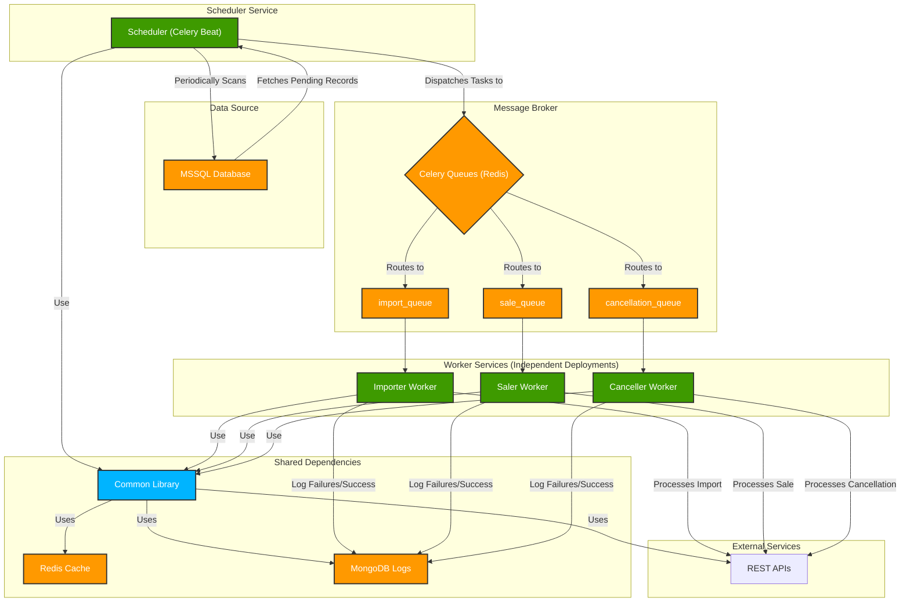

### **Revised Project Plan: Independent Data-Pipeline Services**
### **Kế hoạch Dự án Sửa đổi: Các Dịch vụ Xử lý Dữ liệu Độc lập**

Based on your feedback, I have updated the architecture to split the system into three separate applications for each pipeline (`import`, `sale`, `cancellation`), a dedicated scheduler, and a shared common library. This allows for independent deployment and scaling of each component.

*Dựa trên phản hồi của bạn, tôi đã cập nhật kiến trúc để tách hệ thống thành ba ứng dụng riêng biệt cho mỗi luồng dữ liệu (`nhập`, `bán`, `hủy`), một ứng dụng lập lịch chuyên dụng, và một thư viện chung được chia sẻ. Điều này cho phép triển khai và mở rộng quy mô độc lập cho từng thành phần.*

---

#### **1. Revised Project Structure / Cấu trúc Dự án Sửa đổi**

The project will be organized as a monorepo with a shared library and four distinct applications:
*Dự án sẽ được tổ chức dưới dạng monorepo với một thư viện chung và bốn ứng dụng riêng biệt:*

```
syncdataDQG/
├── common/                   # Shared library for all services / Thư viện chung cho tất cả các dịch vụ
│   ├── __init__.py
│   ├── config.py             # Centralized configuration / Cấu hình tập trung
│   ├── database/             # Shared database clients / Các client CSDL dùng chung
│   │   ├── __init__.py
│   │   ├── mssql_client.py
│   │   ├── mongo_client.py
│   │   └── redis_client.py
│   ├── models/               # Shared Pydantic models / Các model Pydantic dùng chung
│   │   ├── __init__.py
│   │   └── pydantic_models.py
│   └── services/             # Shared API client / API client dùng chung
│       ├── __init__.py
│       └── api_client.py
│
├── importer/                 # Import-specific application / Ứng dụng cho luồng Nhập
│   ├── __init__.py
│   ├── celery_app.py         # Celery app for 'import_queue' / App Celery cho 'import_queue'
│   ├── tasks.py              # Import tasks / Các task Nhập
│   └── run.py                # Script to start import worker / Script chạy worker Nhập
│
├── saler/                    # Sale-specific application / Ứng dụng cho luồng Bán
│   ├── __init__.py
│   ├── celery_app.py         # Celery app for 'sale_queue' / App Celery cho 'sale_queue'
│   ├── tasks.py              # Sale tasks / Các task Bán
│   └── run.py                # Script to start sale worker / Script chạy worker Bán
│
├── canceller/                # Cancellation-specific application / Ứng dụng cho luồng Hủy
│   ├── __init__.py
│   ├── celery_app.py         # Celery app for 'cancellation_queue' / App Celery cho 'cancellation_queue'
│   ├── tasks.py              # Cancellation tasks / Các task Hủy
│   └── run.py                # Script to start cancellation worker / Script chạy worker Hủy
│
├── scheduler/                # Celery Beat scheduler application / Ứng dụng lập lịch Celery Beat
│   ├── __init__.py
│   ├── celery_app.py         # Celery app to connect to broker / App Celery để kết nối broker
│   ├── tasks.py              # Orchestration task / Task điều phối
│   └── run.py                # Script to start Celery Beat / Script chạy Celery Beat
│
├── .env.example
├── requirements.txt          # Combined requirements for all services / Thư viện chung cho các dịch vụ
└── docker-compose.yml        # Optional: To run all services together / Tùy chọn: Để chạy tất cả dịch vụ cùng lúc
```

#### **2. Component Design / Thiết kế Thành phần**

*   **`common/`**: This directory will contain all the shared logic: database connections, API client (with token management), Pydantic models, and configuration. This prevents code duplication.
    *   *Thư mục này sẽ chứa tất cả logic dùng chung: kết nối cơ sở dữ liệu, API client (với quản lý token), model Pydantic và cấu hình. Điều này giúp tránh trùng lặp mã nguồn.*
*   **`importer/`, `saler/`, `canceller/`**: Each of these is a self-contained Celery application. It will import the necessary components from the `common` library. Each application will define and listen to its own dedicated queue (`import_queue`, `sale_queue`, `cancellation_queue`).
    *   *Mỗi thư mục này là một ứng dụng Celery độc lập. Nó sẽ nhập các thành phần cần thiết từ thư viện `common`. Mỗi ứng dụng sẽ định nghĩa và lắng nghe trên hàng đợi riêng của mình (`import_queue`, `sale_queue`, `cancellation_queue`).*
*   **`scheduler/`**: This is a special Celery application that only runs Celery Beat. Its task will be to query the MSSQL database and dispatch processing tasks to the appropriate queues for the other workers to pick up.
    *   *Đây là một ứng dụng Celery đặc biệt chỉ chạy Celery Beat. Nhiệm vụ của nó là truy vấn CSDL MSSQL và gửi các task xử lý đến các hàng đợi thích hợp để các worker khác tiếp nhận.*

#### **3. Revised System Architecture Diagram / Sơ đồ Kiến trúc Hệ thống Sửa đổi**

This diagram shows the new architecture with independent services.
*Sơ đồ này thể hiện kiến trúc mới với các dịch vụ độc lập.*


---

#### **4. Task ID and Data Sync Tracking / Theo dõi ID Tác vụ và Trạng thái Đồng bộ**

This section clarifies how Celery Task IDs are managed and how the synchronization status of data is tracked and verified. The process uses both MongoDB (for real-time operational logs) and MSSQL (as the final source of truth for data status).

*Phần này làm rõ cách ID của Tác vụ Celery được quản lý và cách trạng thái đồng bộ hóa dữ liệu được theo dõi và xác minh. Quy trình này sử dụng cả MongoDB (cho log vận hành thời gian thực) và MSSQL (làm nguồn dữ liệu gốc cuối cùng cho trạng thái dữ liệu).*

1.  **Source of Truth (MSSQL) / Nguồn dữ liệu gốc (MSSQL):**
    The `status` column in the original MSSQL tables (`SalesInvoices`, `PurchaseReceipts`, etc.) is the **definitive source of truth**. It tells us whether a record needs to be synced (`PENDING_SYNC`), has been synced successfully (`SYNC_SUCCESS`), or has failed permanently (`SYNC_FAILED`).
    *Cột `status` trong các bảng MSSQL gốc (`SalesInvoices`, `PurchaseReceipts`, v.v.) là **nguồn thông tin xác thực cuối cùng**. Nó cho chúng ta biết một bản ghi cần được đồng bộ (`PENDING_SYNC`), đã đồng bộ thành công (`SYNC_SUCCESS`), hay đã thất bại vĩnh viễn (`SYNC_FAILED`).*

2.  **Operational Logging (MongoDB) / Ghi Log Vận hành (MongoDB):**
    The `task_logs` collection in MongoDB is used for **real-time monitoring, debugging, and temporary operational data**. When a task is dispatched by the Scheduler, a log entry is created in MongoDB. This entry links the Celery-generated `task_id` to the business data's primary key (e.g., `local_invoice_id`). This allows us to trace the execution of a specific data record through the system.
    *Collection `task_logs` trong MongoDB được sử dụng để **giám sát thời gian thực, gỡ lỗi và lưu dữ liệu vận hành tạm thời**. Khi một tác vụ được Scheduler gửi đi, một bản ghi log sẽ được tạo trong MongoDB. Bản ghi này liên kết `task_id` do Celery tạo ra với khóa chính của dữ liệu nghiệp vụ (ví dụ: `local_invoice_id`). Điều này cho phép chúng ta truy vết quá trình thực thi của một bản ghi dữ liệu cụ thể trong hệ thống.*

3.  **The Workflow / Luồng hoạt động:**
    *   **Step 1 (Scheduling):** The **Scheduler** queries MSSQL for records where `status = 'PENDING_SYNC'`.
    *   **Step 2 (Dispatch & Log):** For each record, the Scheduler dispatches a Celery task and immediately creates a log in MongoDB's `task_logs` collection with the `celery_task_id` and the record's business ID.
    *   **Step 3 (Processing):** A **Worker** picks up the task.
    *   **Step 4 (Final Update):**
        *   On **successful** API sync, the worker updates the `status` in the **MSSQL** table to `SYNC_SUCCESS` and also updates the `national_invoice_id` (or equivalent) returned by the API.
        *   If the task **fails** after all retries, the worker updates the `status` in the **MSSQL** table to `SYNC_FAILED` and logs the detailed error payload to the `sync_failures` collection in MongoDB for analysis.

##### **Data Tracking Flow Diagram / Sơ đồ Luồng Theo dõi Dữ liệu**

```mermaid
sequenceDiagram
    participant S as Scheduler
    participant MDB as MongoDB
    participant MS as MSSQL Database
    participant Q as Celery Queue
    participant W as Worker

    S->>MS: 1. Query for records with status='PENDING_SYNC'
    MS-->>S: Returns pending records

    loop For each record
        S->>Q: 2a. Dispatch task (e.g., process_sale)
        Q-->>S: Returns celery_task_id
        S->>MDB: 2b. Create log in 'task_logs' (celery_task_id, local_invoice_id, status: PENDING)
    end

    W->>Q: 3. Pick up task from queue
    W->>E: 4. Process data and call external API

    alt Sync Success
        E-->>W: Returns Success + national_id
        W->>MS: 5a. UPDATE status='SYNC_SUCCESS', national_id=... WHERE local_invoice_id=...
        W->>MDB: 6a. UPDATE log in 'task_logs' (status: SUCCESS)
    else Sync Fails after all retries
        E-->>W: Returns Final Error
        W->>MS: 5b. UPDATE status='SYNC_FAILED' WHERE local_invoice_id=...
        W->>MDB: 6b. Log full payload and error to 'sync_failures'
        W->>MDB: 6c. UPDATE log in 'task_logs' (status: FAILED)
    end