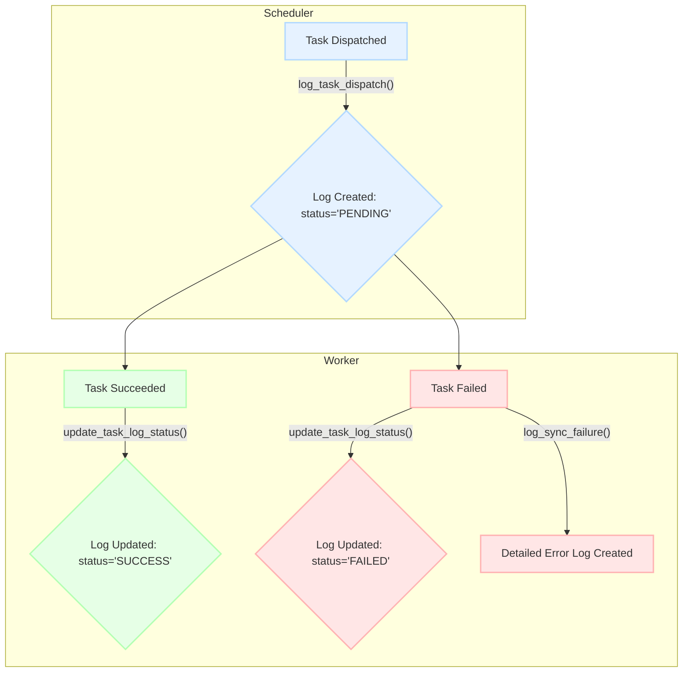

# Phân Tích Hệ Thống Đồng Bộ Dữ Liệu

Tài liệu này phân tích kiến trúc và luồng hoạt động của hệ thống đồng bộ dữ liệu, được xây dựng dựa trên kiến trúc microservices sử dụng Celery và Docker.

## 1. Tổng Quan Kiến Trúc

Dự án này là một hệ thống xử lý dữ liệu bất đồng bộ, có nhiệm vụ tự động trích xuất dữ liệu từ một CSDL MSSQL cục bộ, xử lý, và đồng bộ lên một hệ thống API quốc gia.

### Các Thành Phần Chính:

*   **`scheduler` (Bộ Lập Lịch):** Là "bộ não" của hệ thống, định kỳ quét CSDL để tìm dữ liệu mới và điều phối công việc cho các workers.
*   **`saler`, `importer`, `canceller` (Workers):** Các microservice độc lập, mỗi service xử lý một nghiệp vụ cụ thể (bán hàng, nhập kho, hủy phiếu) sau khi nhận tác vụ từ scheduler.
*   **`common` (Thư Viện Chung):** Một thư viện chứa mã nguồn được chia sẻ giữa các service, bao gồm cấu hình, kết nối CSDL, models dữ liệu và API clients.
*   **Cơ Sở Hạ Tầng:**
    *   **Redis:** Đóng vai trò là Message Broker, quản lý hàng đợi tác vụ (task queues).
    *   **MSSQL:** CSDL nguồn chứa dữ liệu kinh doanh.
    *   **MongoDB:** Dùng để lưu trữ log chi tiết về trạng thái và lỗi của các tác vụ.
    *   **Docker:** Đóng gói mỗi service thành một container độc lập, dễ dàng triển khai và quản lý.

### Sơ Đồ Kiến Trúc Tổng Thể

```mermaid
graph TD
    subgraph "Scheduler Service"
        A["Celery Beat (mỗi phút)"] --> B{Task: scan_and_dispatch};
        B --> C{"Quét MSSQL tìm dữ liệu mới (Bán hàng, Nhập, Hủy)"};
    end

    subgraph "Message Queues (Redis)"
        Q1["sale_queue"];
        Q2["import_queue"];
        Q3["cancellation_queue"];
    end

    subgraph "Worker Services"
        W1["Saler Worker"];
        W2["Importer Worker"];
        W3["Canceller Worker"];
    end

    subgraph "External Systems"
        DB_MSSQL["MSSQL Database"];
        EXT_API["National API"];
        DB_MONGO["MongoDB (Logs)"];
    end

    C -- "Tìm thấy Hóa đơn" --> |"Gửi task sale.process_sale"| Q1;
    C -- "Tìm thấy Phiếu nhập" --> |"Gửi task import.process_import"| Q2;
    C -- "Tìm thấy Phiếu hủy" --> |"Gửi task cancellation.process_cancellation"| Q3;

    Q1 --> W1;
    Q2 --> W2;
    Q3 --> W3;

    W1 -- "Xử lý Hóa đơn" --> DB_MSSQL;
    W1 -- "Gửi/Cập nhật" --> EXT_API;
    W1 -- "Ghi Log" --> DB_MONGO;

    W2 -- "Xử lý Phiếu nhập" --> DB_MSSQL;
    W2 -- "Gửi/Cập nhật" --> EXT_API;
    W2 -- "Ghi Log" --> DB_MONGO;

    W3 -- "Xử lý Phiếu hủy" --> DB_MSSQL;
    W3 -- "Gửi/Cập nhật" --> EXT_API;
    W3 -- "Ghi Log" --> DB_MONGO;

    classDef scheduler fill:#e6f2ff,stroke:#b3d9ff,stroke-width:2px;
    classDef worker fill:#e6ffe6,stroke:#b3ffb3,stroke-width:2px;
    classDef queue fill:#fff0e6,stroke:#ffccb3,stroke-width:2px;
    classDef external fill:#f2f2f2,stroke:#cccccc,stroke-width:2px;

    class A,B,C scheduler;
    class W1,W2,W3 worker;
    class Q1,Q2,Q3 queue;
    class DB_MSSQL,EXT_API,DB_MONGO external;
```

## 2. Luồng Hoạt Động Chi Tiết

Luồng hoạt động bắt đầu từ `scheduler`, đi qua hàng đợi `Redis`, và kết thúc ở các `worker`.

**Ví dụ với luồng bán hàng (`saler`):**

1.  **Scheduler:** Mỗi phút, `scheduler` chạy tác vụ `scan_and_dispatch`, quét bảng hóa đơn trong MSSQL.
2.  **Dispatch:** Khi tìm thấy hóa đơn mới, `scheduler` gửi một tác vụ `sale.process_sale` vào hàng đợi `sale_queue` trên Redis. Đồng thời, một bản ghi log với trạng thái `PENDING` được tạo trong MongoDB.
3.  **Worker:** `saler` worker, vốn đang lắng nghe trên `sale_queue`, sẽ nhận tác vụ.
4.  **Process:** `saler` thực hiện các bước:
    a.  Dùng ID hóa đơn để lấy dữ liệu chi tiết từ MSSQL.
    b.  Chuyển đổi dữ liệu sang Pydantic model để chuẩn hóa.
    c.  Gửi dữ liệu đã chuẩn hóa đến API quốc gia.
    d.  Dựa trên kết quả trả về từ API, cập nhật trạng thái hóa đơn trong MSSQL (`SYNC_SUCCESS` hoặc `SYNC_FAILED`).
    e.  Cập nhật bản ghi log trong MongoDB sang `SUCCESS` hoặc `FAILED`. Nếu thất bại, một bản ghi lỗi chi tiết sẽ được tạo.

## 3. Phân Tích Các Thành Phần

### 3.1. Thư Viện `common`

Đây là thư viện chung, tuân thủ nguyên tắc DRY (Don't Repeat Yourself), chứa các mã nguồn được sử dụng lại bởi tất cả các service.

*   **`config.py`**: Tải cấu hình từ file `.env` (thông tin CSDL, API).
*   **`database/`**: Chứa các clients để tương tác với MSSQL (`mssql_client.py`) và MongoDB (`mongo_client.py`).
*   **`models/`**: Chứa các Pydantic models (`pydantic_models.py`) để định nghĩa và xác thực cấu trúc dữ liệu.
*   **`services/`**: Chứa API client (`api_client.py`) để đóng gói logic giao tiếp với API quốc gia.

### 3.2. Hệ Thống Ghi Log (MongoDB)

Hệ thống sử dụng MongoDB để ghi log có cấu trúc, giúp việc giám sát và gỡ lỗi hiệu quả.

*   **Collection `task_logs`**: Lưu trữ vòng đời của mỗi tác vụ (PENDING -> SUCCESS/FAILED).
*   **Collection `sync_failures`**: Khi một tác vụ thất bại, một bản ghi chi tiết sẽ được lưu tại đây, bao gồm:
    *   `business_id`: ID của đối tượng nghiệp vụ bị lỗi.
    *   `payload`: Dữ liệu JSON đã được chuẩn bị để gửi đi.
    *   `error`: Toàn bộ thông tin traceback của lỗi.
    *   `timestamp`: Thời điểm xảy ra lỗi.

Sơ đồ vòng đời của một bản ghi log:


## 4. Cách Chạy và Triển Khai

Mỗi service (`scheduler`, `saler`, `importer`, `canceller`) là một ứng dụng Celery và được đóng gói trong một Docker container riêng.

*   Để khởi động **scheduler**:
    ```bash
    celery -A scheduler.celery_app beat -l info
    ```
*   Để khởi động một **worker** (ví dụ `saler`):
    ```bash
    celery -A saler.celery_app worker -l info -Q sale_queue
    ```

Hệ thống có thể được triển khai dễ dàng bằng `docker-compose` để khởi chạy tất cả các service và cơ sở hạ tầng cần thiết.
