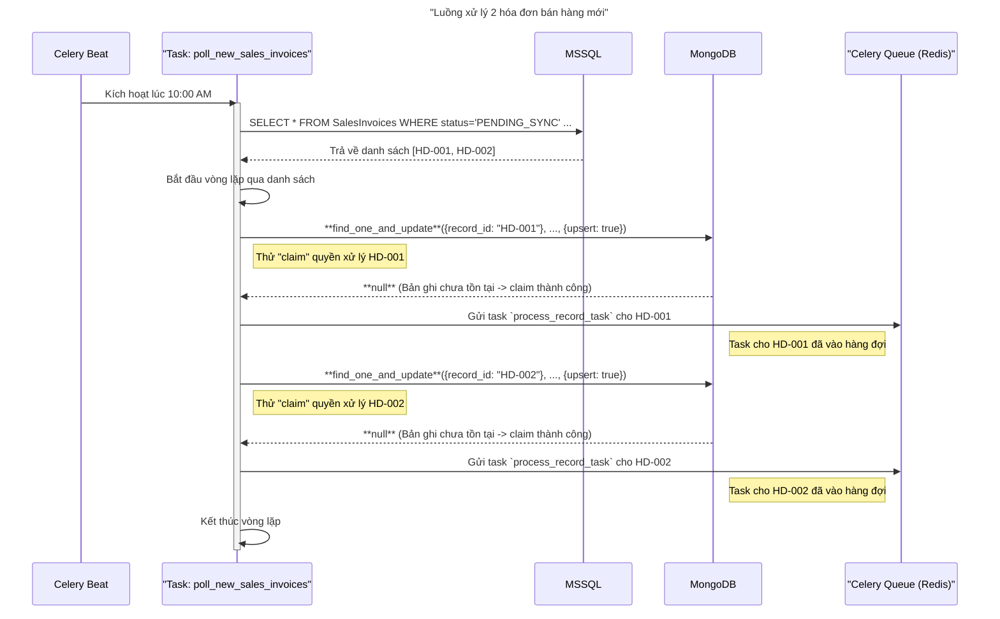

# Tài liệu Luồng Logic - Giai đoạn 2
Tài liệu này minh họa chi tiết luồng xử lý của hệ thống khi phát hiện và đưa các bản ghi mới vào hàng đợi, dựa trên kiến trúc đã thống nhất trong `PHASE_2_DETAILED_PLAN.md`.
## Kịch bản: Polling và Xử lý 2 Hóa đơn mới
Giả sử trong cơ sở dữ liệu MSSQL có hai hóa đơn mới (`HD-001`, `HD-002`) với `status = 'PENDING_SYNC'`.
### Sơ đồ Luồng xử lý

### Diễn giải chi tiết các bước
1.  **Kích hoạt (Trigger):**
    *   Đúng theo lịch trình (ví dụ: mỗi phút), **Celery Beat** sẽ gửi một lệnh để thực thi task `poll_new_sales_invoices`.

2.  **Truy vấn Dữ liệu (Query):**
    *   **Poller Task** được một Celery worker nhận và bắt đầu chạy.
    *   Nó thực hiện một câu lệnh `SELECT` đến **MSSQL** để tìm tất cả các bản ghi trong bảng `SalesInvoices` có `status = 'PENDING_SYNC'` và được tạo trong ngày.
    *   **MSSQL** trả về một danh sách chứa dữ liệu của hai hóa đơn: `HD-001` và `HD-002`.

3.  **Lặp và "Claim" (Loop & Claim):**
    *   **Poller Task** bắt đầu một vòng lặp (for loop) qua danh sách vừa nhận được.
    *   **Lượt 1 (Hóa đơn `HD-001`):**
        *   Nó gửi một lệnh `find_one_and_update` đến **MongoDB** với `record_id: "HD-001"` và tùy chọn `upsert=True`. Đây là hành động "đặt cờ" hay "claim" quyền xử lý.
        *   Vì đây là lần đầu tiên `HD-001` được xử lý, không có bản ghi log nào tồn tại trong MongoDB. Lệnh này sẽ tạo mới một bản ghi log và trả về `null`.
        *   Code trong Poller kiểm tra thấy kết quả là `null`, hiểu rằng nó đã "claim" thành công.
        *   Nó liền tạo một task `process_record_task` với dữ liệu của `HD-001` và đẩy vào **Hàng đợi (Redis)**.
    *   **Lượt 2 (Hóa đơn `HD-002`):**
        *   Tiến trình lặp lại tương tự. Poller gửi lệnh `find_one_and_update` cho `record_id: "HD-002"`.
        *   **MongoDB** xác nhận chưa có log cho `HD-002`, tạo mới và trả về `null`.
        *   Poller lại "claim" thành công và tạo task `process_record_task` cho `HD-002`, đẩy vào **Hàng đợi (Redis)**.

4.  **Kết quả:**
    *   Kết thúc Giai đoạn 2, trong **Hàng đợi (Redis)** sẽ có hai task chờ xử lý, một cho `HD-001` và một cho `HD-002`.
    *   Trong **MongoDB**, sẽ có hai bản ghi log tương ứng với hai hóa đơn này, đều có `status: 'QUEUED'`.
    *   Quan trọng nhất, nếu một worker khác có lỡ chạy cùng lúc và cũng tìm thấy `HD-001`, nó sẽ không thể "claim" được nữa vì bản ghi log đã được tạo bởi worker đầu tiên.

Tài liệu này cho thấy luồng đi của dữ liệu từ cơ sở dữ liệu nguồn đến hàng đợi xử lý một cách an toàn và tuần tự cho từng bản ghi trong một lần chạy của task polling.