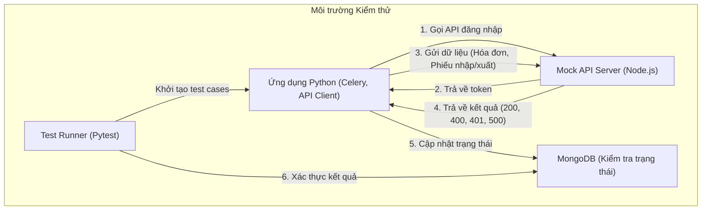

# Kế hoạch Kiểm thử Hệ thống Đồng bộ với Mock API Server

**Mục tiêu:** Đảm bảo ứng dụng Python (Celery workers, API client) hoạt động chính xác với `mock_api_server`, bao gồm các kịch bản thành công, lỗi và các trường hợp đặc biệt.

---

### 1. Tổng quan kiến trúc kiểm thử

Sơ đồ dưới đây mô tả luồng tương tác trong môi trường kiểm thử. "Test Runner" (ví dụ: `pytest`) sẽ khởi tạo các tác vụ trong ứng dụng Python, ứng dụng này sau đó sẽ tương tác với `mock_api_server` thay vì API thật của Cơ quan quản lý.

---

### 2. Các Giai đoạn Kiểm thử

Kế hoạch kiểm thử sẽ được chia thành các giai đoạn, tương ứng với các giai đoạn phát triển trong kế hoạch ban đầu.

#### Giai đoạn 1: Kiểm thử Core API Client (Tương ứng Giai đoạn 2 của Development)

**Mục tiêu:** Xác thực module API Client có thể đăng nhập, quản lý token và xử lý các phản hồi cơ bản từ `mock_api_server`.

*   **Test Case 1.1: Đăng nhập thành công**
    *   **Mô tả:** Gọi hàm `login()` với `usr: "admin"` và `pwd: "password123"`.
    *   **Kết quả mong đợi:** Nhận được token JWT hợp lệ.

*   **Test Case 1.2: Đăng nhập thất bại**
    *   **Mô tả:** Gọi hàm `login()` với thông tin đăng nhập sai.
    *   **Kết quả mong đợi:** API trả về lỗi `400 Bad Request` và ứng dụng xử lý lỗi này một cách hợp lệ.

*   **Test Case 1.3: Gửi dữ liệu với token hợp lệ**
    *   **Mô tả:** Sau khi đăng nhập thành công, sử dụng token nhận được để gọi một trong các endpoint nghiệp vụ (ví dụ: `/api/lien_thong/hoa_don`).
    *   **Kết quả mong đợi:** API trả về một trong các phản hồi đã được định nghĩa (200, 400, hoặc 500) và ứng dụng xử lý tương ứng.

*   **Test Case 1.4: Gửi dữ liệu với token không hợp lệ/hết hạn**
    *   **Mô tả:** Cố gắng gọi endpoint nghiệp vụ với một token giả hoặc đã hết hạn.
    *   **Kết quả mong đợi:** `mock_api_server` trả về lỗi `401 Unauthorized`.

*   **Test Case 1.5: Gửi dữ liệu không có token**
    *   **Mô tả:** Cố gắng gọi endpoint nghiệp vụ mà không có header `Authorization`.
    *   **Kết quả mong đợi:** `mock_api_server` trả về lỗi `401 Unauthorized`.

#### Giai đoạn 2: Kiểm thử Logic Đồng bộ và Tác vụ Celery (Tương ứng Giai đoạn 3 & 4 của Development)

**Mục tiêu:** Đảm bảo luồng đồng bộ từ đầu đến cuối hoạt động chính xác, từ việc lấy dữ liệu, đưa vào hàng đợi Celery, cho đến khi nhận phản hồi từ API và cập nhật trạng thái.

*   **Test Case 2.1: Luồng đồng bộ thành công**
    *   **Mô tả:** Chạy một tác vụ Celery để đồng bộ một bản ghi. Mock API được cấu hình để chắc chắn trả về `200 OK`.
    *   **Kết quả mong đợi:** Trạng thái của bản ghi trong MSSQL/MongoDB được cập nhật thành `SYNC_SUCCESS` và có `national_..._id`.

*   **Test Case 2.2: Xử lý lỗi `400 Bad Request`**
    *   **Mô tả:** Chạy tác vụ Celery, Mock API được cấu hình để trả về `400 Bad Request`.
    *   **Kết quả mong đợi:** Trạng thái bản ghi được cập nhật thành `SYNC_FAILED` với thông báo lỗi tương ứng. Tác vụ không nên được `retry`.

*   **Test Case 2.3: Xử lý lỗi `500 Internal Server Error`**
    *   **Mô tả:** Chạy tác vụ Celery, Mock API được cấu hình để trả về `500 Internal Server Error`.
    *   **Kết quả mong đợi:** Tác vụ Celery sẽ được `retry` theo cấu hình (ví dụ: 3 lần). Trạng thái bản ghi vẫn là `PENDING_SYNC` hoặc chuyển sang `RETRYING`.

#### Giai đoạn 3: Kiểm thử Xử lý lỗi nâng cao và Phục hồi (Tương ứng Giai đoạn 4 & 5 của Development)

**Mục tiêu:** Kiểm tra khả năng phục hồi của hệ thống, bao gồm cơ chế retry, dead-letter queue và làm mới token.

*   **Test Case 3.1: Cơ chế Retry của Celery**
    *   **Mô tả:** Liên tục để Mock API trả về lỗi `500`.
    *   **Kết quả mong đợi:** Quan sát trong Celery Flower/logs thấy tác vụ được thử lại đúng số lần đã cấu hình.

*   **Test Case 3.2: Dead-Letter Queue (DLQ)**
    *   **Mô tả:** Sau khi tác vụ thất bại hết số lần `retry` (từ Test Case 3.1), kiểm tra hàng đợi DLQ.
    *   **Kết quả mong đợi:** Tác vụ thất bại được chuyển vào DLQ. Trạng thái bản ghi được cập nhật thành `SYNC_DEAD_LETTER`.

*   **Test Case 3.3: Tự động làm mới Token**
    *   **Mô tả:**
        1.  Đăng nhập để lấy token.
        2.  Chỉnh sửa `JWT_SECRET` trong `mock_api_server` để làm cho token hiện tại không hợp lệ.
        3.  Chạy một tác vụ đồng bộ.
    *   **Kết quả mong đợi:**
        1.  API Client nhận lỗi `401 Unauthorized`.
        2.  API Client tự động gọi lại hàm `login()` để lấy token mới.
        3.  API Client thử lại yêu cầu gửi dữ liệu ban đầu với token mới và thành công.